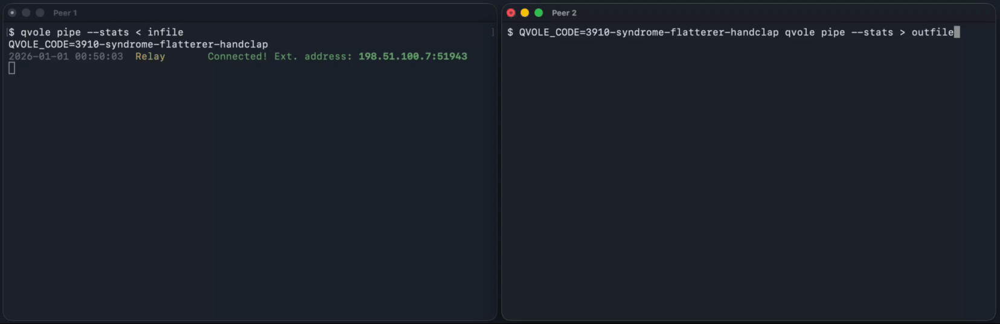

<p align="center"></p>

<h1 align="center">qvole</h1>
<p align="center">
  <a href="https://go.dev"></a>
  <a href="https://github.com/fernjager/qvole/actions/workflows/ci.yml"></a>
  <a href="LICENSE"></a>
</p>
<p align="center"><em>Fast tunnels over QUIC, burrowed through NATs.</em></p>

Two machines, both behind NAT. Share a short code with your peer and you have an encrypted pipe between you.

Forward ports, transfer files, run remote commands and pipes. A single binary, no config files, no setup.

<p align="center"></p>

---

## Quick Start Examples

See [examples](#pipe) further below for more inspiration!

```bash
# Send a file
alice$ qvole pipe > out                                         # prints connection code, waits for bob
bob$   QVOLE_CODE=CODE qvole pipe < in                          # bob connects with code, sends file to alice

# Send a directory
alice$ tar czf - dir/ | qvole pipe                              # alice streams tar of dir/ to bob
bob$   QVOLE_CODE=CODE qvole pipe | tar xzf -                   # bob receives and extracts dir/

# Port Forwarding
alice$ qvole tunnel -L 8080:localhost:80 -R 2222:localhost:22   # alice sets up config, bob accepts
bob$   QVOLE_CODE=CODE qvole tunnel --allow-tunnel
alice$ curl localhost:8080                                      # reaches bob's :80
bob$   ssh -p 2222 localhost                                    # reaches alice's sshd

# Remote command (alice hosts the command, bob connects)
alice$ qvole exec --cmd "uptime"                                # runs on alice, bob sees output
alice$ qvole exec --cmd "script -q bash /dev/null"              # alice gives bob remote shell
bob$   QVOLE_CODE=CODE qvole exec

# Run a private relay server (UDP)
relay$ qvole relay --listen :9009
```

---

## Install

**curl one-liner:**

```bash
curl -fsSL https://get.qvole.dev | sh
```

**From source:**

```bash
git clone https://github.com/fernjager/qvole && cd qvole && make && sudo make install
```

(Requires Go 1.26+)

---

## The Problem

I run services everywhere: a homelab, VPSs, a travel router with a cellular SIM on a sailboat.
The usual options (VPNs, SSH reverse tunnels, port forwarding) all need certs, key distribution,
or reachable ports. Every open port is a potential zero-day,
and a personal server that gets patched on a good day can't keep up.

I'd rather bind services to localhost, leave zero inbound ports, and reach them
on demand through a shared code. That also solves three harder problems:
discovery (both peers are behind NAT), authentication (no PKI, just a code),
and transport (tunneling TCP inside TCP is its own kind of broken).

## The Solution

`qvole` is a single binary that creates encrypted, direct P2P tunnels between
two machines. You share a code, and within seconds you have a QUIC connection
with stdin/stdout pipes, TCP port forwarding, or remote command execution. No
accounts, no config files, a minimal public relay handles rendezvous only. It never decrypts your traffic.

Inspired by [magic-wormhole](https://github.com/magic-wormhole/magic-wormhole),
qvole uses QUIC as the transport instead and works by composing three well-understood
primitives:

### SPAKE2: Password-Authenticated Key Exchange

Each peer sends a blinded elliptic curve point. From the pair
they derive a shared secret that nobody else can compute, not even the relay. The code
*is* the credential, and after the handshake its role is done.

### QUIC: Stream Multiplexing over UDP

A single UDP socket supports multiple independent byte streams with no head-of-line blocking,
built-in TLS 1.3, independent flow control per stream. Every connection is always
encrypted and always authenticated.

### UDP Hole Punching: NAT Traversal

Two peers behind independent NATs send packets to each other's external address
simultaneously. Each outbound packet opens a pinhole that lets the other side's packet
through. This is the same NAT traversal technique used by video calls and teleconferencing, which
works across many common NAT configurations.

### The Cryptographic Handoff

None of these concepts are new, the trick is how they come together for this specific application.

The key aspect is that a TLS certificate fingerprint is exchanged alongside the SPAKE2 blinded point and then bound to the shared secret via the PAKE-derived confirm HMAC, authenticating the TLS session.

This allows a cryptographic handoff from a low-entropy code to a strong 256-bit TLS session with forward secrecy, authenticated by said fingerprint, all within a few seconds:

```
Shared code (52-bit)
       │
       ▼
  SPAKE2 PAKE ──► session keys + peer's cert fingerprint
       │
       ▼
  Hole punch ──► direct UDP path
       │
       ▼
  QUIC/TLS 1.3 ──► pinned fingerprint verification
       │
       ▼
  Streams ──► data (pipe, exec, tunnel)
```

After the handshake, the relay sees nothing. It can't derive keys, decrypt traffic, or impersonate a peer.

Even if someone later brute-forces or learns the code and recorded all relay traffic, they can at most recover the certificate fingerprint, not the TLS QUIC session keys that protect the actual data.

**Hence the name: a vole burrows under obstacles, and `qvole` burrows QUIC tunnels under NATs.**

## Design Philosophy

`qvole` is intentionally minimalist. It does one thing: establish an ad-hoc encrypted
tunnel between two peers. Features like SOCKS or HTTP proxies, file
transfer commands, etc. are deliberately absent because existing tools already fill those roles when composed with `qvole`.

`qvole` won't be your SOCKS proxy. SSH handles that well. But `qvole` will get you the tunnel to run SSH over.

By sticking to stdin/stdout streams and TCP port forwarding, `qvole` composes naturally
with the rest of your system.

**This is Unix philosophy: each tool does one thing, and pipes connect them.**

`qvole` is opinionated and admittedly a bit niche. It scratches my own itch:
I'm paranoid about open ports, and I needed a way to reach my machines on-demand
without exposing them. If this tool happens to be useful to anyone else, that would be great!

### Protocol

**[Full protocol specification → PROTOCOL.md](./PROTOCOL.md)**

The handshake completes in seconds: SPAKE2 PAKE over a UDP relay for peer discovery
and authentication, then UDP hole punching for direct NAT traversal, then a QUIC
connection with pinned self-signed certificates.

Refer to the above for a step-by-step description of the lifecycle of a connection, as well as the structure of the datagrams going over the wire.

### Security

**[Full security documentation → SECURITY.md](./SECURITY.md)**

`qvole`'s security model is a cryptographic handoff: SPAKE2 PAKE authenticates both
peers from a shared code, then TLS 1.3 with pinned certificate fingerprints
secures the direct QUIC data path. The relay is assumed to be untrusted: it cannot derive
session keys, decrypt traffic, or impersonate a peer.

Refer to the above for a detailed breakdown where we cover the threat model, protocol security analysis,
design tradeoffs, and limitations.

### Limitations and Tradeoffs

#### Network Connectivity
* **Inconsistent Network Support**: I tested `qvole` on home broadband, airport wifi, and mobile hotspots. Whether it connects depends on the network setup. Most times it worked, in rare cases it did not. There is no fallback, so you need another way to connect.
* **No Data Relay Fallback**: We do not implement a TURN relay to keep the relay server simple and prevent it from ever touching user data. This means connections fail when both peers are behind restrictive symmetric NATs that prevent UDP hole punching; there is no data-relay fallback path.
* **UDP-Only**: The protocol relies purely on UDP with no TCP fallback. Highly restrictive environments that block all outgoing UDP traffic will prevent connection establishment.

#### Operational Constraints
* **Relay is Single Point of Failure**: Peers cannot discover each other or exchange handshake material without the relay. If the relay is unavailable, no connections can be established.
* **Two Peers Only**: The protocol supports exactly two peers per connection. Multi-party conferencing is not supported.

#### Performance & Scalability
* **Stateless Relay Design**: The relay does not implement message queuing or persistent storage. This allows it to remain extremely low-overhead and protects against state-exhaustion attacks, but means messages may be lost if a client is temporarily unreachable during a handshake.
* **Rate Limiting**: We implement strict rate limiting (e.g., 10 msg/s per client) to prevent relay abuse. This ensures stability for the community but may limit extremely high-frequency signaling.

---

## Go Library

Use `qvole` in your own Go programs:

```go
import "github.com/fernjager/qvole"
```

```go
// Simple peer-to-peer pipe
conn, _ := qvole.Dial(ctx,
    qvole.WithCode("my-secret"),
    qvole.WithRelay("relay.qvole.dev:9009"),
)
conn.Write([]byte("hello"))
conn.Close()

// Remote command execution
qvole.Exec(ctx,
    qvole.WithCode("secret"),
    qvole.WithRelay("relay.qvole.dev:9009"),
    qvole.WithCommand("uptime"), qvole.WithCmdMode(true),
)

// Port forwarding
qvole.Tunnel(ctx,
    qvole.WithCode("secret"),
    qvole.WithRelay("relay.qvole.dev:9009"),
    qvole.WithLocalTunnel("8080:localhost:80"), qvole.WithAllowTunnel(true),
)

// Run your own relay
go relay.RunRelay(ctx, ":9009")
conn, _ = qvole.Dial(ctx,
    qvole.WithCode("secret"), qvole.WithRelay("localhost:9009"),
)
```

See **[LIBRARY.md](./LIBRARY.md)** for the full API reference, option reference, stats tracking, and more examples.

## Subcommands

```
Usage:
  qvole pipe      [--code CODE] [--stats]                            # pipe mode
  qvole tunnel    -L request [-L ...] [-R ...] [--code CODE]         # port forwarding
  qvole exec      --cmd cmd [--code CODE]                            # remote command
  qvole relay     [--listen :9009]                                   # relay server

Common command flags (pipe / exec / tunnel):
  --code CODE        connection code (or $QVOLE_CODE)
  --relay addr       relay address (host:port)
  --debug            verbose debug logging to stderr
```

### Pipe

stdin/stdout pipe over up to two QUIC streams (one when stdin is a terminal, two when stdin is piped). Bidirectional.
When no code is provided, one is generated and printed to `stderr`.

| Flag | Description |
|------|-------------|
| `--relay addr` | Relay address (host:port) |
| `--stats` | Log transfer statistics to stderr |
| `--debug` | Verbose debug logging to stderr |

**Examples:**

`qvole` opens up a direct P2P data transfer with no relay bottleneck after the handshake completes.
Every connection is a QUIC session, so you can pipe over it, not just send files.

```bash
# Monitor throughput: use built-in --stats (no pv needed)
alice$ qvole pipe --stats < largefile.dat
bob$   QVOLE_CODE=CODE qvole pipe --stats > received.dat

# Sample --stats output to stderr:
# ↑ 5.20 MB (2.60 MB/s)  ↓ 10.40 MB (5.20 MB/s)
# ↑ 10.40 MB (2.60 MB/s)  ↓ 20.80 MB (5.20 MB/s)
# ...
# Total: ↑ 50.00 MB  ↓ 100.00 MB

# Disk cloning: clone a remote drive over the P2P tunnel
alice$ sudo dd if=/dev/sda | qvole pipe
bob$   QVOLE_CODE=CODE qvole pipe | sudo dd of=/dev/sdb

# Database backup: pipe a dump over the tunnel
alice$ pg_dump mydb | gzip | qvole pipe
bob$   QVOLE_CODE=CODE qvole pipe | gunzip | psql mydb

# Webcam/media streaming: stream from a capture device
alice$ ffmpeg -i /dev/video0 -f mpegts - | qvole pipe
bob$   QVOLE_CODE=CODE qvole pipe | ffplay -

# Remote log tailing: tail logs from a remote system
alice$ journalctl -f | qvole pipe
bob$   QVOLE_CODE=CODE qvole pipe

# Gzip compression: compress data over the wire
alice$ tar czf - dir/ | qvole pipe
bob$   QVOLE_CODE=CODE qvole pipe | tar xzf -

# Remote packet capture: capture network traffic remotely
alice$ tcpdump -w - -i eth0 | qvole pipe
bob$   QVOLE_CODE=CODE qvole pipe > capture.pcap

# Clipboard sync: share a snippet between machines
alice$ qvole pipe | pbcopy
bob$   pbpaste | QVOLE_CODE=CODE qvole pipe

# Simple P2P Chat: direct bidirectional text communication (use cat to bridge terminal)
alice$ cat | qvole pipe
bob$   cat | QVOLE_CODE=CODE qvole pipe
```

#### Shell Helpers
```bash
# Shell helpers: pre-share a code for always-on access between trusted machines
# Generate a code once, then add to ~/.bashrc on both machines:
$ openssl rand -base64 24
$ echo 'export QVOLE_CODE=<generated-code>' >> ~/.bashrc
$ echo "qsend() { tar czf - \"\$@\" | qvole pipe --stats; }" >> ~/.bashrc
$ echo "qrecv() { qvole pipe --stats | tar xzf -; }" >> ~/.bashrc
$ echo "alias qp='qvole pipe --stats'" >> ~/.bashrc

alice$ qsend file.dat                              # send a file (gzipped)
alice$ qsend dir/                                  # send a directory (gzipped)
bob$   qrecv                                       # receive and extract
alice$ qsend file1.dat dir/                        # send multiple
bob$   qrecv                                       # receive all

alice$ arecord -f cd | qp                          # stream mic over P2P (macOS: ffmpeg -f avfoundation -i ":0" -f mp3 - | qp)
bob$   qp | aplay -f cd                            # hear alice's mic (or: qp | ffplay -i pipe:0 -nodisp)
```

### Exec

One side runs a local command directly and bridges its stdin/stdout to
the QUIC stream; the other side operates as a plain pipe (stdin→stream→stdout).

| Flag | Description |
|------|-------------|
| `--cmd <cmd>` | Run `<cmd>` locally and pipe its stdin/stdout through the tunnel |
| `--code CODE`  | Connection code (or `$QVOLE_CODE`) |
| `--relay addr` | Relay address (host:port) |
| `--debug` | Verbose debug logging to stderr |

Unlike the pipe subcommand (where stream direction depends on whether stdin is a terminal; piped stdin opens an outbound stream, terminal stdin does not),
the `exec` side always opens the stream and the pipe side always accepts.
Only the side with `--cmd` runs a command; the other side simply connects.

**Examples:**

Ad-hoc remote server administration and accessing services without SSH key
distribution in restrictive networks or customer sites.

```bash
# Remote shell: full interactive shell over the tunnel
alice$ qvole exec --cmd "script -q bash /dev/null"
bob$   QVOLE_CODE=CODE qvole exec

# Remote monitoring: use script -q for TUI apps
alice$ qvole exec --cmd "script -q htop /dev/null"
bob$   QVOLE_CODE=CODE qvole exec

# Remote disk usage: explore disk usage remotely
alice$ qvole exec --cmd "script -q 'ncdu /' /dev/null"
bob$   QVOLE_CODE=CODE qvole exec

# Remote log inspection: view logs on a remote system
alice$ qvole exec --cmd "journalctl -n 100 --no-pager"
bob$   QVOLE_CODE=CODE qvole exec

# Remote system info: check remote system details
alice$ qvole exec --cmd "uname -a; uptime"
bob$   QVOLE_CODE=CODE qvole exec

# Docker management: run docker commands on a remote host
alice$ qvole exec --cmd "docker ps"
bob$   QVOLE_CODE=CODE qvole exec

# Remote packet capture: stream capture to local tcpdump
alice$ qvole exec --cmd "tcpdump -w - -i eth0"
bob$   QVOLE_CODE=CODE qvole exec | tcpdump -r -

# Shared Terminal session: collaborative terminal via tmux
alice$ qvole exec --cmd "script -q 'tmux new -A -s qvole' /dev/null"
bob$   QVOLE_CODE=CODE qvole exec
```

### <a id="tunnel"></a>Tunnel

TCP port tunneling over QUIC tunnels, modeled after SSH `-L` and `-R`.

| Flag | Description |
|------|-------------|
| `-L [addr:]port:host:port` | Listen on `[addr:]port`, forward connections to `host:port` on the peer's side |
| `-R [addr:]port:host:port` | Peer listens on `[addr:]port`, forwards connections to `host:port` on your side |
| `--code CODE` | Connection code (or `$QVOLE_CODE`) |
| `--relay addr` | Relay address (host:port) |
| `--allow-tunnel` | Accept incoming tunnel connections |
| `--debug` | Verbose debug logging to stderr |

Multiple `-L` and `-R` flags can be combined.

```bash
# Alice listens on 8080, forwards to Bob's :80
alice$ qvole tunnel -L 8080:localhost:80
bob$   QVOLE_CODE=CODE qvole tunnel --allow-tunnel

# Alice asks Bob to listen on 9022 and forward back to Alice's :22
alice$ qvole tunnel -R 9022:localhost:22
bob$   QVOLE_CODE=CODE qvole tunnel --allow-tunnel

# Combined: Alice gets Bob's :80 on :8080 AND Bob gets Alice's :22 on :9022
alice$ qvole tunnel -L 8080:localhost:80 -R 9022:localhost:22
bob$   QVOLE_CODE=CODE qvole tunnel --allow-tunnel
```

| Flag form | Meaning |
|-----------|---------|
| `-L port:host:port` | Listen on `127.0.0.1:port`, forward to `host:port` on peer |
| `-L addr:port:host:port` | Listen on `addr:port`, forward to `host:port` on peer |
| `-R port:host:port` | Peer listens on `127.0.0.1:port`, forwards to `host:port` on your side |
| `-R addr:port:host:port` | Peer listens on `addr:port`, forwards to `host:port` on your side |

**Examples:**

TCP traffic forwarding without requiring root, kernel modules, TUN devices, or persistent state.
Point-to-point between exactly two peers; forward-secret across restarts.

```bash
# Postgres: remote database access
alice$ qvole tunnel -L 5432:localhost:5432
bob$   QVOLE_CODE=CODE qvole tunnel --allow-tunnel

# Remote desktop: tunnel VNC over the P2P link
alice$ qvole tunnel -L 5900:localhost:5900
bob$   QVOLE_CODE=CODE qvole tunnel --allow-tunnel

# Remote Docker daemon: no exposed TCP socket needed
alice$ qvole tunnel -L 2375:localhost:2375
bob$   QVOLE_CODE=CODE qvole tunnel --allow-tunnel

# SOCKS proxy: route traffic through the peer's network
alice$ ssh -D 1080 localhost -N                      # start local SOCKS proxy
alice$ qvole tunnel -R 1080:localhost:1080           # expose it to Bob
bob$   QVOLE_CODE=CODE qvole tunnel --allow-tunnel   # Bob now has SOCKS on :1080

# Monitoring stack: reach Prometheus/Grafana behind NAT
alice$ qvole tunnel -L 9090:localhost:9090 -L 3000:localhost:3000
bob$   QVOLE_CODE=CODE qvole tunnel --allow-tunnel

# Media server: watch Plex/Jellyfin on a remote TV
alice$ qvole tunnel -L 32400:localhost:32400
bob$   QVOLE_CODE=CODE qvole tunnel --allow-tunnel

# SSH escape hatch: expose sshd on a locked-down machine
alice$ qvole tunnel -R 2222:localhost:22
bob$   QVOLE_CODE=CODE qvole tunnel --allow-tunnel
bob$   ssh -p 2222 localhost                         # Bob reaches Alice's sshd

# Game servers: host a Minecraft server behind NAT
alice$ qvole tunnel -L 25565:localhost:25565
bob$   QVOLE_CODE=CODE qvole tunnel --allow-tunnel

# Redis: access a remote Redis instance
alice$ qvole tunnel -L 6379:localhost:6379
bob$   QVOLE_CODE=CODE qvole tunnel --allow-tunnel

# Web dev preview: expose a local dev server to a peer
alice$ npm run dev                                   # running on :3000
alice$ qvole tunnel -R 3000:localhost:3000           # Alice exposes her :3000 to Bob
bob$   QVOLE_CODE=CODE qvole tunnel --allow-tunnel   # Bob can now visit localhost:3000
```


#### Persistent Tunnels
```bash
# Auto-reconnect: reconnect on disconnect with a fixed code
alice$ while true; do QVOLE_CODE=CODE qvole tunnel -L 8080:localhost:80; sleep 1; done

# For long-lived deployments, generate a strong random code:
$ openssl rand -base64 24

# Alternatively, systemd persistence to keep the tunnel alive forever
# /etc/systemd/system/qvole-tunnel.service
[Unit]
Description=qvole P2P tunnel
After=network-online.target

[Service]
Type=simple
# Generate a strong code first: openssl rand -base64 24
Environment=QVOLE_CODE=<generated-code>
ExecStart=/usr/local/bin/qvole tunnel -L 8080:localhost:80
Restart=always
RestartSec=5

[Install]
WantedBy=multi-user.target
```

### Environment

#### Client variables (pipe / exec / tunnel)

| Variable | Default | Description |
|----------|---------|-------------|
| `QVOLE_CODE` | - | Connection code (alternative to `--code`) |
| `QVOLE_KDF_ITERATIONS` | 600000 | PBKDF2 iterations for code-to-scalar derivation |
| `QVOLE_KEEPALIVE_MS` | 2000 | QUIC keepalive interval |
| `QVOLE_IDLE_TIMEOUT_MS` | 120000 | QUIC idle timeout before disconnect |
| `QVOLE_HANDSHAKE_TIMEOUT_MS` | 30000 | Handshake timeout |
| `QVOLE_MAX_STREAMS` | 100 | Max concurrent QUIC streams |
| `QVOLE_FORWARD_MAX_STREAMS` | 200 | Max forwarded tunnel streams |
| `QVOLE_PUNCH_TIMEOUT_MS` | 10000 | UDP hole punch timeout |
| `QVOLE_EXCHANGE_DEADLINE_MS` | 300000 | SPAKE2 exchange deadline |
| `QVOLE_SPAKE2_RESEND_MS` | 2000 | SPAKE2 message resend interval |
| `QVOLE_CONFIRM_RESEND_MS` | 2000 | Confirm message resend interval |
| `QVOLE_EXCHANGE_READ_DEADLINE_MS` | 1000 | Relay read poll interval |
| `QVOLE_REG_INTERVAL_MS` | 60000 | Relay registration interval |
| `QVOLE_DIAL_TIMEOUT_MS` | 10000 | Tunnel TCP dial timeout |
| `QVOLE_EXEC_DRAIN_TIMEOUT_MS` | 5000 | Exec drain timeout after command exit |
| `QVOLE_INITIAL_STREAM_WINDOW` | 1048576 | QUIC stream receive window |
| `QVOLE_INITIAL_CONNECTION_WINDOW` | 4194304 | QUIC connection receive window |

#### Relay variables (`relay` subcommand)

| Variable | Default | Description |
|----------|---------|-------------|
| `QVOLE_RELAY_MAX_ROOMS` | 10000 | Maximum concurrent rooms |
| `QVOLE_RELAY_MAX_CLIENTS` | 2 | Maximum clients per room |
| `QVOLE_RELAY_MAX_ROOMS_PER_IP` | 100 | Maximum rooms per IP address |
| `QVOLE_RELAY_MSG_RATE` | 10 | Maximum messages per rate window per client |
| `QVOLE_RELAY_RATE_WINDOW_MS` | 1000 | Rate window duration for message limiting |
| `QVOLE_RELAY_TTL_MS` | 300000 | Registration TTL before client expires |
| `QVOLE_RELAY_CLEANUP_INTERVAL_MS` | 60000 | Cleanup interval for expired registrations |
| `QVOLE_RELAY_WORKERS` | 4 | Number of worker goroutines |
| `QVOLE_RELAY_PKT_CHAN_BUF` | 256 | Packet channel buffer size |
| `QVOLE_RELAY_WRITE_DEADLINE_MS` | 500 | UDP write deadline |
| `QVOLE_RELAY_STATS_INTERVAL_MS` | 300000 | Stats logging interval |

### Privacy & Terms

[Privacy policy and terms of service for the public relay &rarr; PRIVACY.md](./PRIVACY.md)

---

